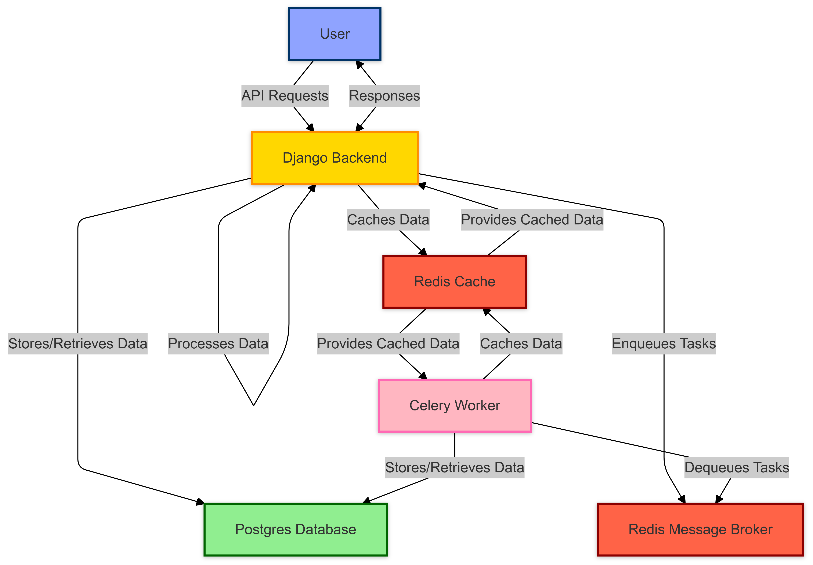

<p align="center">
	
</p>
<p align="center">
    <h1 align="center">Mapapi</h1>
</p>
<p align="center">
    <em>Comprehensive backend solution for managing and visualizing environment-related incidents via the Map Action platform.</em>
</p>
<p align="center">
	
	
	
	
</p>
<p align="center">
		<em>Developed with the software and tools below.</em>
</p>
<p align="center">
	
	
	
	
	<br>
	
	
	
	
</p>

## Table of Contents

-   [Overview](#overview)
-   [Technologies Used](#technologies-used)
-   [Core Features](#core-features)
-   [System Architecture](#system-architecture)
-   [Local Development Environment Setup](#local-development-environment-setup)
    -   [Prerequisites](#prerequisites)
    -   [Step 1: Clone the Repository](#step-1-clone-the-repository)
    -   [Step 2: Configure Environment Variables](#step-2-configure-environment-variables)
    -   [Step 3: Build and Run the Application Services](#step-3-build-and-run-the-application-services)
    -   [Step 4: Access the Running Application](#step-4-access-the-running-application)
    -   [Step 5: Verify the Setup (Recommended)](#step-5-verify-the-setup-recommended)
    -   [Step 6: Stopping the Application](#step-6-stopping-the-application)
    -   [Running Management Commands](#running-management-commands)
-   [How to Contribute](#how-to-contribute)
-   [Project Authors](#project-authors)
-   [Licensing Information](#licensing-information)
-   [Developer Documentation Link](#developer-documentation-link)
-   [Digital Public Goods Assessment](#digital-public-goods-assessment)

## Overview

Mapapi (Map Action API) serves as the backend API for the Map Action platform. It provides a robust and scalable solution for managing, storing, and retrieving data related to environment-related incidents reported via the associated mobile app and dashboard.

## Technologies Used

-   **Django**: High-level Python web framework used for building the core RESTful API.
-   **PostgreSQL**: Powerful, open-source object-relational database system used for persistent data storage (users, incidents, etc.).
-   **Celery**: Distributed task queue system for handling background processes asynchronously, ensuring the API remains responsive.
-   **Redis**: In-memory data structure store, primarily used as a fast message broker for Celery task queues and potentially for caching.
-   **Docker & Docker Compose**: Containerization technology used to package the application and its dependencies, ensuring consistent development, testing, and deployment environments.
-   **Nginx**: High-performance web server often used as a reverse proxy and load balancer (acting as the entry point in the local setup).
-   **Daphne**: ASGI server used to run the Django application, enabling handling of asynchronous requests.

## Core Features

-   **Incident Management API**: Provides RESTful endpoints for CRUD (Create, Read, Update, Delete) operations on environmental incident data.
-   **User Authentication & Authorization**: Manages user accounts, registration, login, and permissions.
-   **Asynchronous Task Processing**: Offloads tasks like sending notifications or processing media uploads to Celery workers.
-   **Geospatial Data Capabilities**: Implied functionality for handling location data associated with incidents.

## System Architecture


*This diagram shows the flow of requests and the interaction between the various components like Nginx, the Django API (api-server), PostgreSQL database, Redis, and Celery workers.*

## Local Development Environment Setup

Follow these steps carefully to configure and run the Mapapi project on your local machine using Docker for development and testing purposes.

### Prerequisites

Before you start, ensure you have the following essential tools installed on your system:

-   **Docker Engine:** The core engine for creating and running containers. Download and install it from the official Docker website: [Install Docker Engine](https://docs.docker.com/engine/install/)
-   **Docker Compose:** The tool used to define and manage multi-container applications based on YAML configuration files. Docker Compose V2 is typically included with Docker Desktop installations. Verify your installation: [Install Docker Compose](https://docs.docker.com/compose/install/)

### Step 1: Clone the Repository

Get a local copy of the project's source code.

```bash
# Clone the original repository from GitHub
git clone https://github.com/223MapAction/Mapapi.git

# Navigate into the newly created project directory
cd Mapapi
```

**Note:** If you first *forked* the repository to your own GitHub account (perhaps under a different name like `Mapapi-Contribution`), clone *your fork* using its specific URL. Then, ensure you `cd` into the correct directory name that was created locally (e.g., `cd Mapapi-Contribution`).

### Step 2: Configure Environment Variables

Mapapi requires specific environment variables for configuration, such as database credentials and secret keys.

-   The project should contain an example file named **`.env.example`** in the root directory. This file lists the necessary variables.
-   Create your own local configuration file by **copying** this example:

    ```bash
    # Make sure you are in the project's root directory
    cp .env.example .env
    ```
-   Open the newly created **`.env`** file in your text editor.
-   Review the variables. While many defaults in `.env.example` might work for local setup, you might need to set specific values (especially for external service keys if you plan to test those features, though they might not be required for basic setup).
-   **Crucially:** The **`.env`** file contains sensitive information and **should NEVER be committed to Git**. It is intentionally included in the `.gitignore` file to prevent accidental commits.

### Step 3: Build and Run the Application Services

Use Docker Compose to build the required Docker images and start all the necessary services (API, database, Redis, Nginx, Celery, etc.).

-   Execute the following command from the project's root directory:

    ```bash
    # Use the specific compose file provided and build images if needed
    docker-compose -f _cd_pipeline.yml up --build
    ```

    *   **`docker-compose -f _cd_pipeline.yml`**: Tells Docker Compose to use this specific configuration file.
    *   **`up`**: Starts all the services defined in the file in the foreground, displaying their logs.
    *   **`--build`**: Forces Docker Compose to build the images for services like `api-server` before starting them. This is important on the first run or after changing Dockerfiles or dependencies (like `requirements.txt`). You can omit `--build` on subsequent runs for faster startup if no underlying code/dependencies have changed.

-   You will see logs from various containers being created and started. **Keep this terminal window running** – closing it will stop the application services.
-   **Note on Migrations:** The startup command for the `api-server` service in the `_cd_pipeline.yml` file is configured to automatically wait for the database and then apply any necessary Django database migrations (`makemigrations`, `migrate`). You **do not** need to run these migrations manually as a separate step after starting the containers. Check the initial logs from the `api-server` container to confirm migrations ran successfully.

### Step 4: Access the Running Application

Once all containers are up and running (check the logs from the previous step), the application should be accessible through the Nginx gateway.

-   Open your preferred web browser.
-   Navigate to: **`http://localhost`** (This uses the default HTTP port 80, which Nginx is configured to listen on in the `_cd_pipeline.yml` file).

-   You should see the Django REST Framework's browsable API interface or potentially a landing page served by the application, confirming it's running.

### Step 5: Verify the Setup (Recommended)

Perform these quick checks in a **new terminal window** (while the services are still running from the `docker-compose up` command in the first terminal) to ensure key components are functioning correctly.

-   #### Check Container Status:
    List all running containers managed by the compose file:
    ```bash
    docker-compose -f _cd_pipeline.yml ps
    ```
    *   **Expected Outcome:** You should see multiple services listed (e.g., `api-server`, `postgres-db`, `redis-server`, `celery_worker`, `nginx`, `pgadmin`). Verify their `State` is `Up`.

-   #### Confirm API Access:
    Re-check access in your web browser as described in Step 4: `http://localhost`.
    *   **Expected Output:** Successful loading of the API interface or application page.

-   #### Test a Management Command:
    Execute a simple Django management command *inside* the `api-server` container:
    ```bash
    docker-compose -f _cd_pipeline.yml exec api-server python3 manage.py showmigrations
    ```
    *   **Expected Output:** The command should run without errors and list all the Django apps and the status of their database migrations (most should have `[X]` indicating they are applied).

### Step 6: Stopping the Application

When you're finished working with the application:

1.  Go back to the **first terminal window** where you ran `docker-compose up ...`.
2.  Press **`Ctrl + C`** to stop the running services gracefully.
3.  **(Optional Cleanup):** To stop and *remove* the containers, networks, and volumes created by `up`, you can run:
    ```bash
    docker-compose -f _cd_pipeline.yml down
    ```

### Running Management Commands

To execute other Django `manage.py` commands (like `createsuperuser`, `shell`, `dbshell`, custom commands) while the services are running via `docker-compose up`:

1.  Open a **new terminal window**.
2.  Navigate to the project's root directory.
3.  Use the `docker-compose exec` command, specifying the `api-server` service:

    ```bash
    docker-compose -f _cd_pipeline.yml exec api-server python3 manage.py <your_command_here>
    ```
    *Replace `<your_command_here>` with the actual command and arguments (e.g., `createsuperuser`, `shell`).*

---

## How to Contribute

Map Action is an open-source project, and we warmly welcome contributions from the community! Whether it's reporting bugs, proposing new features, improving documentation, or writing code, your help is valued.

Please refer to our detailed [**Contribution Guidelines**](CONTRIBUTING.md) before submitting contributions. This ensures a smooth and effective process for everyone.

Key contribution areas include:

-   **Reporting Issues:** Use the GitHub Issues tab to report bugs or suggest enhancements. Check if a similar issue exists first!
-   **Submitting Pull Requests (PRs):** For code or documentation changes, follow the fork/branch/PR workflow described in the guidelines. Ensure your PRs are well-described and reference relevant issues (e.g., `Closes #123`).
-   **Code Reviews:** Help review existing Pull Requests to improve code quality and share knowledge.
-   **Discussions:** Participate in discussions on GitHub Issues or other community channels.

## Project Authors

This project is developed and maintained by our dedicated code squad: A7640S, Yugo19 & immerSIR.

## Licensing Information

Mapapi is licensed under the [**GNU Affero General Public License v3.0 (AGPL-3.0)**](LICENSE). Please review the `LICENSE` file in the repository for the full terms and conditions.

## Developer Documentation Link

For more in-depth technical details, API specifications, and advanced guides, please consult the hosted [**Developer Documentation**](https://223mapaction.github.io/Mapapi/).

## Digital Public Goods Assessment

Mapapi has undergone an assessment against the Digital Public Goods Standard. You can find the detailed report here: [**DPG Assessment**](DPG_ASSESSMENT.md). This document outlines our alignment with principles like open standards, open licensing, and relevance to Sustainable Development Goals (SDGs).

```

---